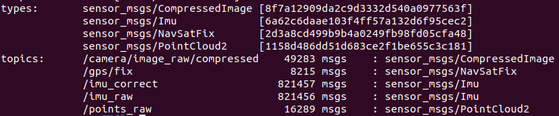

# LIV-SAM复现与实机部署

## 源码编译
由于LIV-SAM原仓库建设于Ubuntu18.04上，因此在Ubuntu20.04的ROS Noetic版本上编译可能会存在一些问题，以下为编译过程，包含一些问题与解决方案：

### 源码的选择
由于LVI-SAM的官方源码存在着传感器参数混乱、自身部署复杂等问题，因此官方在其github仓库下也提供了三个其他版本的源码，这里我们选择[Easyused版本](https://github.com/Cc19245/LVI-SAM-Easyused)

### 编译过程
```bash
mkdir -p ~/catkin_ws/src 
cd ~/catkin_ws/src
git clone https://github.com/Cc19245/LVI-SAM-Easyused
cd LVI-SAM-Easyused
git checkout new
cd ..
catkin_make
```
这里比作者的readme中多了第四行，这是因为不进入LVI-SAM文件无法进行切换new分支

### 问题1
```
Could not find a package configuration file provided by "GTSAM" with any of
the following names:

GTSAMConfig.cmake
gtsam-config.cmake
```
这种情况一般是没有安装GTSAM，当然为了保险，我们先检查一下系统中是否含有GTSAM包，使用`locate GTSAM`，如果没有安装，则运行后没有任何输出。
如果爆出：`locate not found`,说明没有安装`mlocate`，运行`sudo apt-get install mlocate`进行安装即可。

GTSAM推荐在github上下载源码进行编译，这里注意ubuntu20.04使用GTSAM 4.0.3及以上的版本，否则会报“The "debug" argument must be followed by a library.”之类的错误。目前网上的解决方法都是说注释掉报错的部分，但这种操作本身风险就很大，在之后的cmake和install时又会出现其他错误。而我查阅了GTSAM中的issue，发现这个错误在2020年6月（18 Jun）的更新中已经得到了解决。

下载GTSAM4.0.3版本后，以下为编译安装过程：
```bash
#!bash
cd gtsam-4.X.X #替换成自己的目录
mkdir build
cd build
cmake ..
make check
sudo make install
```
安装GTSAM需要注意的点：
make check为检查过程，时间花费较长，若运行过后，出现报错：
```bash
Failure: "expected -4.1072555088854512e-14 but was: -2.0463630789890885e-12"
There were 1 failures
...
The following tests FAILED:
108 - testShonanAveraging (Failed)
```
无需在意，这一部的误差仅有1e-12数量级的误差，我们可以通过修改make的容忍值来避免该报错，但实际上这一步只是检查，因此无需在意，GTSAM的开发者也在github的issue中对该问题进行了回复。

### 问题2
```
: In instantiation of ‘void pcl::DefaultFeatureRepresentation<PointDefault>::NdCopyPointFunctor::operator()() [with Key = pcl::fields::alpha_m; PointDefault = pcl::PPFSignature]’:
```

这是因为ubuntu20.04自带的PCL 1.0需要c++ 14以上进行编译，因此我们需要在LVI-SAM-Easyused功能包中的cmakelist中添加这样一行代码：
```cmake
set(CMAKE_CXX_STANDARD 14)
```

### 问题3
```bash
fatal error: opencv/cv.h: 没有那个文件或目录
```
这是因为ubuntu20.04自带的是opencv4,所以需要对文件进行一定改动
将所有文件中的`#include<opencv/cv.h>`改为`#include<opencv2/imgproc.hpp>`

### 问题4
```bash
error while loading shared libraries: libmetis-gtsam.so: cannot open shared object file: No such file or directory
```
这是因为libmetis-gtsam.so在local/lib中，我们只需将其复制一份到/opt/ros/noetic/lib/中即可
输入命令：
```bash
sudo cp /usr/local/lib/libmetis-gtsam.so /opt/ros/noetic/lib/
```

### 问题5
运行编译过程中还会出现各种各样由于opencv版本不同带来的问题，只需修改报错的对应部分即可。

### bag包的录制
为了更加方便的进行程序的调试，在进行实机部署之前，我们可以先进行数据的录制，待程序调试完毕之后，再进行实际部署。
ROS为数据的录制提供了工具rosbag，录制数据包是通过订阅话题，并将订阅到的数据保存下来，rosbag本质也是节点。

#### 对指定话题的录制：
```bash
rosbag record <话题1> <话题2> <话题N>
```
录制完毕后，会保存数据到本地。
#### 对bag包的信息查看:
```bash
rosbag info <包名>
```
可以查看bag包中发布的话题以及其数据格式
LVI-SLAM需要的话题以及数据格式如下：

值得注意的是，LVI-SAM的点云数据需要ring和time，imu数据为9轴imu数据，图像数据官方为压缩的数据，但它在readme也提到了取消压缩的方法。
#### 运行bag包发布数据
```bash
rosbag play <包名>
```

### To Do List
实机测试前需要完成的工作：
1. 确认传感器数据格式与话题并录制`bag`包（包含激光雷达、9轴imu、单目相机）
   - 其中激光雷达数据要包含`ring`和`time`，数据为`/points_raw`,数据类型为`sensor_msgs/PointCloud2`
   - 相机数据话题为`/camera/image_raw`，数据类型为`sensor_msgs/Image`
   - `imu`话题为`/imu_raw`、数据类型为`sensor_msgs/Imu`
2. 单目相机标定获取相机内参与畸变参数
   - 需要具有标定板或标定纸拍摄一组照片，使用`matlab`或`ROS`的`Camera Calibration`工具
3. 测量并获取`imu`到相机、相机到激光雷达、`imu`到激光雷达的旋转矩阵与平移矩阵
   - 平移矩阵可以测量
   - 旋转矩阵需要获取元件的官方资料，尤其是`imu`和激光雷达的三轴定义方向与安装方向
4. 在电脑上进行调试，调试确认无问题后进行下一步的部署

### 如何适配6轴imu？
因为硬件问题，实机部署时，只能使用6轴的imu，而LVI-SAM中的激光雷达部分的LIO-SAM使用9轴imu，需要RPY角。经过搜索和查看，可以对代码的部分进行修改，实现对6轴imu的适配。
具体修改部分：
1. lidar_odometry/utility.h imuConverter函数修改：
```cpp
#if IF_OFFICIAL
   Eigen::Quaterniond q_final = q_from * extQRPY;
#else
   Eigen::Quaterniond q_final = q_from * Q_quat_lidar;
#endif  
   imu_out.orientation.x = 0; //这里为修改部分
   imu_out.orientation.y = 0; //这里为修改部分
   imu_out.orientation.z = 0; //这里为修改部分
   imu_out.orientation.w = 1; //这里为修改部分
   // if (sqrt(q_final.x()*q_final.x() + q_final.y()*q_final.y() + q_final.z()*q_final.z() + q_final.w()*q_final.w()) < 0.1)
   // {
   //    ROS_INFO("Invalid quaternion, please use a 9-axis IMU!");
   //    //ros::shutdown();
   // }
```
```cpp
nh.param<float>(PROJECT_NAME + "/imuRPYWeight", imuRPYWeight, 0); //这里数字改为0
```
2. lidar_odometry/mapOptmization.cpp publishOdometry函数修改：
```cpp
if (cloudInfo.imuAvailable == true)
{
      if (std::abs(cloudInfo.imuPitchInit) < 1.4)
      {
         double imuWeight = 0; //这里数字改为0
         tf::Quaternion imuQuaternion;
         tf::Quaternion transformQuaternion;
         double rollMid, pitchMid, yawMid;

         // slerp roll
         transformQuaternion.setRPY(roll, 0, 0);
         imuQuaternion.setRPY(cloudInfo.imuRollInit, 0, 0);
         tf::Matrix3x3(transformQuaternion.slerp(imuQuaternion, imuWeight)).getRPY(rollMid, pitchMid, yawMid);
         roll = rollMid;

         // slerp pitch
         transformQuaternion.setRPY(0, pitch, 0);
         imuQuaternion.setRPY(0, cloudInfo.imuPitchInit, 0);
         tf::Matrix3x3(transformQuaternion.slerp(imuQuaternion, imuWeight)).getRPY(rollMid, pitchMid, yawMid);
         pitch = pitchMid;
      }
}
```

修改完毕后，将官方bag中的orientation数据全部改为0 0 0 0后，代码运行正常。
bag包orientation数据修改程序：
```cpp
#include <rosbag/bag.h>
#include <rosbag/view.h>
#include <sensor_msgs/Imu.h>
#include <iostream>

int main(int argc, char** argv) {
    if (argc != 3) {
        std::cerr << "Usage: " << argv[0] << " input.bag output.bag" << std::endl;
        return 1;
    }

    std::string input_bag = argv[1];
    std::string output_bag = argv[2];

    rosbag::Bag inbag(input_bag, rosbag::bagmode::Read);
    rosbag::Bag outbag(output_bag, rosbag::bagmode::Write);

    // 不加任何过滤，读取所有消息
    rosbag::View view(inbag);

    BOOST_FOREACH(rosbag::MessageInstance const& m, view) {
        if (m.getToros_pic() == "/imu/data_raw") {
            sensor_msgs::Imu::ConstPtr imu = m.instantiate<sensor_msgs::Imu>();
            if (imu != nullptr) {
                sensor_msgs::Imu modified_imu = *imu;
                modified_imu.orientation.x = 0.0;
                modified_imu.orientation.y = 0.0;
                modified_imu.orientation.z = 0.0;
                modified_imu.orientation.w = 0.0;

                outbag.write(m.getToros_pic(), m.getTime(), modified_imu);
            }
        } else {
            // 所有其他 toros_pic 都直接写入
            outbag.write(m.getToros_pic(), m.getTime(), m);
        }
    }

    inbag.close();
    outbag.close();

    std::cout << "Modified bag saved to: " << output_bag << std::endl;
    return 0;
}
```

使用方法：
```bash
rosrun *** ***.cpp input.bag(输入的bag地址) output.bag(输出的bag地址)
```

