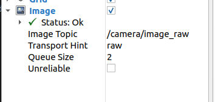
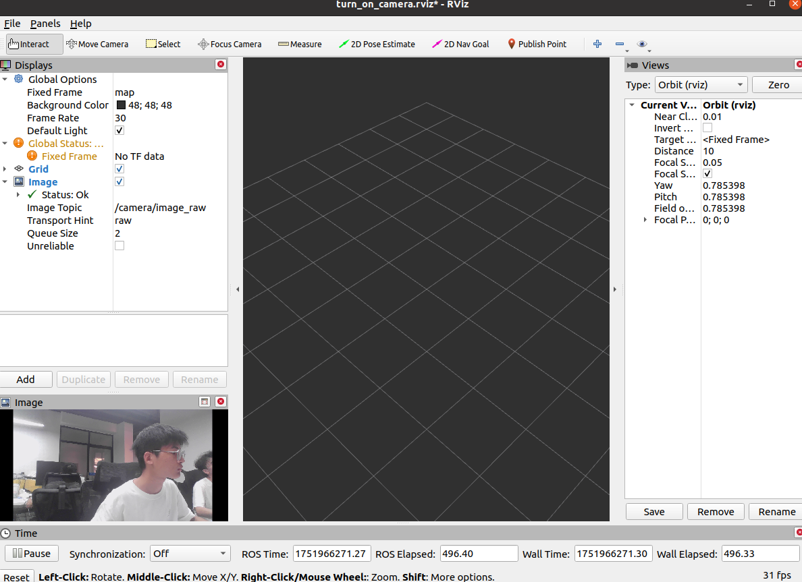

# opencv读取摄像头并发布图像话题数据

## 所需要的依赖
- `std_msgs` 
- `roscpp` 
- `cv_bridge` `ros`和`opencv`图像转换
- `sensor_msgs` 传感器消息
- `image_transport`图像编码传输

## 读取摄像头数据并发布
### 发布者代码编写
```c++
#include <ros/ros.h>
#include <sensor_msgs/Image.h>
#include <sensor_msgs/image_encodings.h>
#include <cv_bridge/cv_bridge.h>
#include <opencv2/opencv.hpp>

int main(int argc, char** argv)
{
    ros::init(argc, argv, "turn_on_camera");
    ros::NodeHandle nh;

    ros::Publisher pub = nh.advertise<sensor_msgs::Image>("/camera/image_raw", 1);

    cv::VideoCapture cap;
    cv::Mat frame;
    int deviceID = 0;

    if (argc > 1) {
        deviceID = atoi(argv[1]);
    }

    cap.open(deviceID);
    if (!cap.isOpened()) {
        ROS_ERROR("Failed to open camera.");
        return -1;
    }

    while (ros::ok()) {
        cap.read(frame);
        if (!frame.empty()) {
            // 将 OpenCV 图像转换为 ROS 消息
            std_msgs::Header header;
            header.stamp = ros::Time::now();
            sensor_msgs::ImagePtr msg = cv_bridge::CvImage(header, "bgr8", frame).toImageMsg();

            pub.publish(msg); // 只发布到 /camera/image_raw
        }

        ros::spinOnce();
    }

    return 0;
}
```
### rviz下可视化
添加以下话题和数据类型的显示

效果：


## 相机标定
使用ROS下的camera_calibration工具包
### 安装
```bash
sudo apt-get install ros-noetic-camera-calibration
```
### 启动标定工具
```bash
rosrun camera_calibration cameracalibrator.py image:=/camera/image_raw camera:=/camera --no-service-check --size 8x6 --square 0.024
```
其中，`image:=`图像话题、`camera:=`相机话题、`--no-service-check`表示忽略相机节点的set_camera_info服务。
`size`和`square`为关键，`size`为标定板行和列的角点数目，`square`表示棋盘格的大小，单位为米

可以将该命令写入launch文件：
```xml
<launch>
    <arg name="size" default="11x8"/>
    <arg name="square" default="0.005"/>
    <node pkg="turn_on_car" type="turn_on_camera" name="turn_on_camera" output="screen" />
    <node pkg="camera_calibration" type="cameracalibrator.py" name="rviz" args="image:=/camera/image_raw camera:=/camera --no-service-check --size $(arg size) --square $(arg square)"/>
</launch>
```
标定时，前后左右移动、翻转标定板直到右侧进度条变绿，点击`calibration`，点击后窗口进入无响应，等待直到窗口恢复正常，则完成标定。

`/tmp`文件下可见标定结果与标定使用的图片
标定结果为：
```yaml
image_width: 1280
image_height: 720
camera_name: camera
camera_matrix:
  rows: 3
  cols: 3
  data: [1184.57339,    0.     ,  706.13879,
            0.     , 1183.14992,  243.86418,
            0.     ,    0.     ,    1.     ]
distortion_model: plumb_bob
distortion_coefficients:
  rows: 1
  cols: 5
  data: [0.005810, 0.078269, -0.011477, 0.023547, 0.000000]
rectification_matrix:
  rows: 3
  cols: 3
  data: [1., 0., 0.,
         0., 1., 0.,
         0., 0., 1.]
projection_matrix:
  rows: 3
  cols: 4
  data: [1190.66638,    0.     ,  727.3983 ,    0.     ,
            0.     , 1211.98474,  238.45543,    0.     ,
            0.     ,    0.     ,    1.     ,    0.     ]
```
而matlab标定结果为：
```yaml
camera matrix：
939.037342533469	0	627.040573010391
0	934.857278900273	350.295490558485
0	0	1

distortion：（径向畸变，k1 k2 k3）
-0.184865518617804	0.670676849301352	-0.744673604969120
```
二者差别较大！这里采用matlab的结果进行去畸变。
标定后，利用内参矩阵和畸变参数，利用以下代码实现去畸变:
```c++
#include <ros/ros.h>
#include <sensor_msgs/Image.h>
#include <sensor_msgs/image_encodings.h>
#include <cv_bridge/cv_bridge.h>
#include <opencv2/opencv.hpp>

int main(int argc, char** argv)
{
    ros::init(argc, argv, "turn_on_camera");
    ros::NodeHandle nh;

    ros::Publisher pub = nh.advertise<sensor_msgs::Image>("/camera/image_raw", 1);

    cv::VideoCapture cap;
    cv::Mat frame, undistortedFrame;
     // 定义相机内参矩阵和畸变系数
    cv::Mat cameraMatrix = (cv::Mat_<double>(3, 3) << 
        939.037342533469,0,627.040573010391,
        0,934.857278900273,350.295490558485,
        0,0,1);
    
    cv::Mat distCoeffs = (cv::Mat_<double>(1, 5) << 
        -0.184865518617804, 0.670676849301352, 0, 0, -0.744673604969120);

    cap.open("/dev/video0", cv::CAP_V4L2);
    if (!cap.isOpened()) {
        ROS_ERROR("Failed to open camera.");
        return -1;
    }

    while (ros::ok()) {
        cap.read(frame);
        if (!frame.empty()) {
            cv::undistort(frame, undistortedFrame, cameraMatrix, distCoeffs);
            // 将 OpenCV 图像转换为 ROS 消息
            std_msgs::Header header;
            header.stamp = ros::Time::now();
            sensor_msgs::ImagePtr msg = cv_bridge::CvImage(header, "bgr8", undistortedFrame).toImageMsg();

            pub.publish(msg); // 只发布到 /camera/image_raw
        }

        ros::spinOnce();
    }

    return 0;
}
```

关于相机标定：
多次标定后发现，当标定板每次占据画面3/5大小上下时，相机标定数据趋于稳定且与`matlab`数据契合