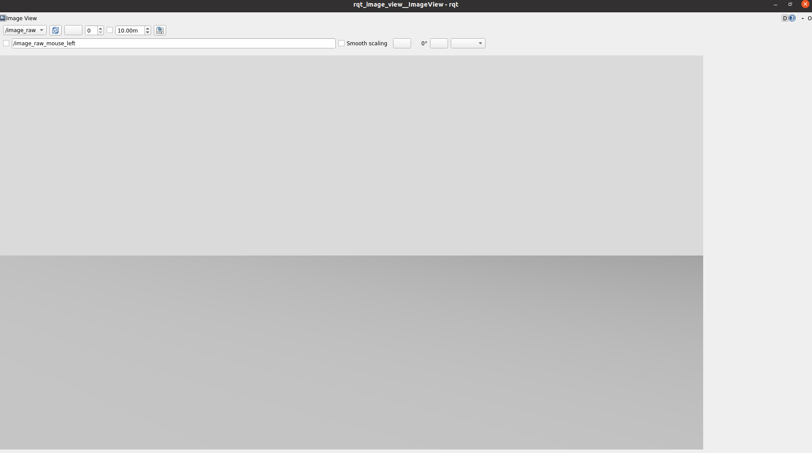

# PX4+ROS2humble基于docker的构建
最近因为科研实习需要，需要利用`ROS2 humble`进行无人机的飞行实验，但是本人电脑双系统使用的是`ubuntu 20.04`,无法使用`ROS2`,因此想到了使用`docker`来解决这个问题，然而因为第一次正儿八经使用`docker`，所以也是一顿`debug`和各种失措，终于经历了多次容器实验后成功搭好了`PX4`仿真无人机`x500_depth`的视觉降落环境。
## docker的安装和ROS2容器构建
### docker在ubuntu 20.04下的安装
关于docker的安装可以参考链接：[ubuntu 20.04 docker安装](https://blog.csdn.net/weixin_40514381/article/details/142908949)
但是关于hello_world镜像安装失败可以参考：[docker添加加速镜像源](https://blog.csdn.net/oyjl__/article/details/143522664)
大致步骤：
#### 更新源
```bash
sudo apt update
sudo apt upgrade
```
#### 卸载旧版本`docker`
```bash
sudo apt remove docker docker-engine docker.io containerd runc 
```
#### 安装`docker`依赖项
```bash
sudo apt install apt-transport-https ca-certificates curl gnupg lsb-release software-properties-common 
```
#### 添加`docker`密钥
```bash
curl -fsSL https://download.docker.com/linux/ubuntu/gpg | sudo gpg --dearmor -o /usr/share/keyrings/docker-archive-keyring.gpg
```
#### 设置`Docker`稳定版下载源
```bash
echo \
  "deb [arch=$(dpkg --print-architecture) signed-by=/usr/share/keyrings/docker-archive-keyring.gpg] https://download.docker.com/linux/ubuntu \
  $(lsb_release -cs) stable" | sudo tee /etc/apt/sources.list.d/docker.list > /dev/null
```
#### 再次更新软件包并安装`Docker Engine`, `CLI` 和 `Containerd`
```bash
sudo apt update
sudo apt install docker-ce docker-ce-cli containerd.io docker-compose-plugin
```
#### 利用`hello_world`验证`docker`
```bash
sudo docker run hello-world
```
这一步若出现hello-world镜像失败或超时，报错：
`    Unable to find image ‘hello-world:latest’ locally
    Trying to pull repository docker.io/library/hello-world …
    /usr/bin/docker-current: missing signature key.
    See ‘/usr/bin/docker-current run --help’.`
这是因为访问镜像源超时，归根结底是网络问题，可以为`docker`镜像源增加加速地址：
```bash
sudo mkdir -p /etc/docker
sudo tee /etc/docker/daemon.json <<-'EOF'
{
    "registry-mirrors": [
        "https://do.nark.eu.org",
        "https://dc.j8.work",
        "https://docker.m.daocloud.io",
        "https://dockerproxy.com",
        "https://docker.mirrors.ustc.edu.cn",
        "https://docker.nju.edu.cn"
    ]
}
EOF
sudo systemctl daemon-reload
sudo systemctl restart docker # 重启docker
systemctl status docker
```
重启`docker`后，运行：
```bash
docker info
```
检查刚刚加入的镜像源是否在里面：

#### 将docker命令加入用户组
可以不使用sudo来执行docker命令
```bash
sudo groupadd docker
sudo usermod -aG docker $USER
newgrp docker
```
### ROS2 Humble容器在docker下的构建
参考链接：[ROS2 humble Docker](https://blog.csdn.net/m0_52820226/article/details/146982980)
#### 拉取官方镜像
```bash
docker pull osrf/ros:humble-desktop-full
```
#### 验证已下载镜像
```bash
docker images | grep humble
```
预期输出：
```bash
osrf/ros   humble-desktop-full   xxxxxx   2 weeks ago   4.5GB
```
#### 创建容器
```bash
docker run -it --name <容器名> \
  --network=host \
  --privileged \
  -e DISPLAY=$DISPLAY \
  -v /tmp/.X11-unix:/tmp/.X11-unix \
  -v /dev:/dev \
  -v /home/<你的用户名>/<某一个文件夹>:/home/humble_ws \
  osrf/ros:humble-desktop-full
```
值得至于的是：
`-v /home/<你的用户名>/<某一个文件夹>:/home/humble_ws`相当于是建立一个你的系统与docker容器之间的共享文件夹
`--network=host`：容器和主机共享网口数据，后面设置docker容器的内部代理很重要
#### 启动X11显示服务
```bash
# 在主机终端执行
xhost +local:root
```
可以将这个加入到`~/.bashrc`中
#### 验证ROS2是否能够使用
传统异能：小海龟
```bash
# 配置ROS环境
echo "source /opt/ros/humble/setup.bash" >> ~/.bashrc
source ~/.bashrc

# 启动测试节点
ros2 run turtlesim turtlesim_node
```

#### `vscode + docker`
后面需要一些指令操作，因此学习一些`docker`的常见命令十分有用，但是`vscode`的`docker`插件很好地弥补了这一点，可以实现傻瓜式使用`docker`容器
首先，第一步安装以下两个`vscode`扩展：

之后，点击`vscode`左侧的`docker`鲸鱼图标，就可以看到我们的容器和已有镜像：

右键点击我们想要操作的容器，有许多选择：
`start`：启动容器
`stop`：停止容器
`restart`：重启容器
`Attach Shell`：在这个容器下打开一个命令窗口，是我们最常使用的
## PX4 + QGC + DDS无人机仿真系统搭建
参考链接1：[阿木实验室](https://www.amovlab.com/news/detail?id=329)
参考链接2：[PX4官方docker关于QGC](https://docs.px4.io/main/zh/test_and_ci/docker)
### PX4安装
利用vscode为容器打开一个终端
#### 安装必要依赖
```bash
sudo apt-get update
sudo apt install python3-pip
sudo apt install git
pip3 uninstall empy
pip3 install empy==3.3.4
sudo apt-get install wget
```
#### 设置git proxy
后面在下载PX4源码时对网络要求较高，因此还是比较建议使用一个流畅好用的代理，我们在打开主机的代理后，需要对容器内的git设置代理：
```bash
git config --global http.proxy http://127.0.0.1:7890/
git config --global https.proxy https://127.0.0.1:7890/
```
这一步要求，我们在前面构建容器的时候一定要配置容器与主机同一网口
#### 安装PX4
git源码，注意：这一步一定要在容器的home目录下：
```bash
cd home/
git clone https://github.com/PX4/PX4-Autopilot.git --recursive
```
下载完成后：
```bash
#下载完成后进入文件夹
cd PX4-Autopilot
#再次输入子模块下载来检查之前子模块是否下载全，若没有输出，说明已下载全
git submodule update --init --recursive
```
之后，回到home目录，执行自动安装：（一定要是home目录）
```bash
# 首先启用全局代理，这是因为后面wget要访问github
export http_proxy=http://127.0.0.1:7890
export https_proxy=https://127.0.0.1:7890
bash ./PX4-Autopilot/Tools/setup/ubuntu.sh
```
安装完毕后，验证：
```bash
cd PX4-Autopilot
make px4_sitl gz_x500
```

### QGC安装并配置
由于docker无法使用appImage，因此我们在主机安装QGC即可，之后进行一定的配置：
#### ubuntu 20.04 QGC地面站
最新版的QGC并不支持在ubuntu 20.04下使用，因此我们需要寻找历史版本的QGC，这里我们使用4.3版本的QGC
在该链接https://github.com/mavlink/qgroundcontrol/releases中寻找即可。
#### 配置QGC
下载之后，直接在下载目录下使用命令行启动即可。
```bash
./QGC....
```
配置QGC，使其能够连接docker容器内的PX4仿真系统：
在QGroundControl中，导航到“设置”并选择“通信链接”。创建一个使用 UDP 协议的新链接。端口取决于所使用的配置，一般默认配置的端口为 14570。IP 地址是您的 Docker 容器的 IP 地址，使用默认网络时通常为 172.17.0.1/16，如下图：

之后点击确认，选择连接即可。
#### 验证
此时在容器内启动仿真后，QGC的左上角会变为ready to fly，如下图：


### XRCE_DDS安装
#### 拉取源码
这一步仍强调为在home目录下：
```bash
git clone https://github.com/eProsima/Micro-XRCE-DDS-Agent.git
```
#### 安装
```bash
#进入DDS目录下
cd Micro-XRCE-DDS-Agent
#新建文件夹build：将会存放编译后的文件
mkdir build
#进入build文件夹
cd build
#执行cmake：配置和生成构建文件
cmake ..
#执行make：编译源码，生成目标文件/可执行文件
make
#安装：安装生成的目标文件到系统目录
sudo make install
#安装后，更新系统动态链接库缓存
sudo ldconfig /usr/local/lib/
#到这里正常情况XRCE_DDS便安装完成
```
#### 验证
在容器中新开一个shell，启用服务
```bash
MicroXRCEAgent udp4 -p 8888
```
之后，新开一个shell启动仿真系统，并打开主机的QGC，此时终端增加新的打印信息：

至此，仿真基本已经完毕

## 视觉降落仿真环境（关于相机话题）
### 仿真环境与带相机的无人机仿真环境启动
依然是要进入PX4那个包里面
```bash
cd PX4-Autopilot/
PX4_GZ_WORLD=aruco make px4_sitl gz_x500_depth
```
其中`PX4_GZ_WORLD=aruco`规定了仿真的环境是带有aruco码的gz世界，其中aruco码默认在原点，可以通过修改sdf文件，修改其位置。
启动后画面：

### 启动相机话题
此时，我们发现输入以下指令：
```bash
ros2 toros_pic list
```
并没有相机话题出现，这是因为我们需要利用gz_bridge将gazebo数据转至ROS2
### 修改相机的sdf文件
修改文件`home/PX4-Autopilot/Tools/simulation/gz/models/OakD-Lite/model.sdf`，在第54行加入`<toros_pic>image_raw</toros_pic>`，如下图：

### 启用gz_brige话题转换
打开一个新的shell，运行以下指令：
```bash
ros2 run ros_gz_bridge parameter_bridge /image_raw@sensor_msgs/msg/Image@gz.msgs.Image
```
之后，在新开一个shell，运行指令：
```bash
ros2 run rqt_image_view rqt_image_view
```
即可看到画面：
