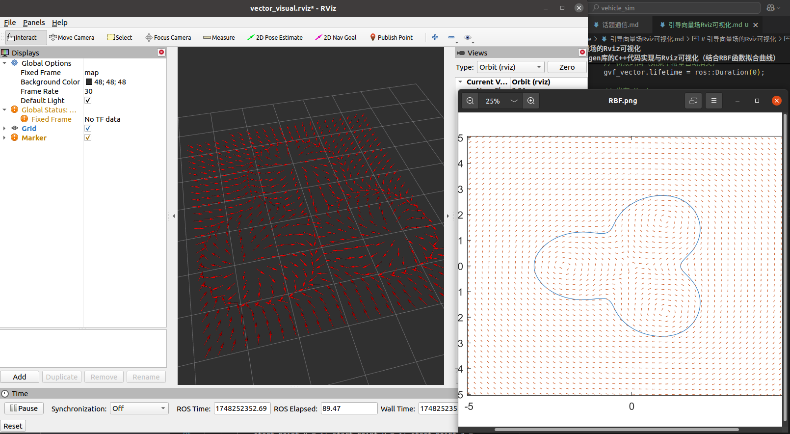

### 公式无法在github网页正常显示，查看[Html文件](引导向量场Rviz可视化.html)
# 引导向量场的Rviz可视化

## 引导向量场
核心公式：
$$
    F(x,y) = E*\phi^{'}(x,y) - k*\phi(x,y)*\phi^{'}(x,y)
$$
其中，$\phi(x,y)$ 表示一条二维空间内的任意曲线，例如单位圆可以被表示为：
$$
    \phi(x,y) = x^2+y^2-1
$$
$\phi^{'}(x,y)$表示该函数分别对于x和y的偏导组成的一个向量，E为旋转矩阵，$E*\phi^{'}(x,y)$表示在空间内围绕该曲线以相同曲率运动的约束项。\
$k*\phi(x,y)*\phi^{'}(x,y)$表示空间内靠近曲线运动的惩罚项，距离曲线越远，惩罚越大。

## 基于Eigen库的C++代码实现与Rviz可视化（结合RBF函数拟合曲线）
```C++
#include <Eigen/Eigen>
#include <Eigen/Dense>
#include <Eigen/Geometry>
#include <Eigen/Eigenvalues>
#include <iostream>
#include <cmath>
#include "ros/ros.h"
#include "std_msgs/Float32MultiArray.h"
#include <visualization_msgs/Marker.h>
struct GVF_vector {
    double x;
    double y;
};

double RBF_function(std::vector<double>& w_array, std::vector<double>& px_array, std::vector<double>& py_array, int num, double x, double y){
    double summary = 0;
    for (size_t i = 0; i < num; i++)
    {
        summary += w_array[i]*(pow(x-px_array[i], 2) + pow(y-py_array[i], 2))*log(std::sqrt(pow(x-px_array[i], 2) + pow(y-py_array[i], 2)) + 1);
    }
    summary -= 1;
    return summary;
}
//中心差分近似求导
double approximate_derivative_opt_x(std::vector<double>& w_array, std::vector<double>& px_array, std::vector<double>& py_array, int num, double x, double y, double h = 1e-3){
    return (RBF_function(w_array, px_array, py_array, num,x+h,y)-RBF_function(w_array, px_array, py_array, num,x-h,y))/(2*h);
}
double approximate_derivative_opt_y(std::vector<double>& w_array, std::vector<double>& px_array, std::vector<double>& py_array, int num, double x, double y, double h = 1e-3){
    return (RBF_function(w_array, px_array, py_array, num,x,y+h)-RBF_function(w_array, px_array, py_array, num,x,y-h))/(2*h);
}
GVF_vector gvf_function(std::vector<double>& w_array, std::vector<double>& px_array, std::vector<double>& py_array, int num, double x, double y){
    int k = 50;
    double derivate_x = approximate_derivative_opt_x(w_array, px_array, py_array, num, x, y);
    double derivate_y = approximate_derivative_opt_y(w_array, px_array, py_array, num, x, y);
    Eigen::MatrixXd derivate_xy(2, 1);
    Eigen::MatrixXd rotationmatrix(2, 2);
    Eigen::MatrixXd gvf_fun(2,1);
    Eigen::MatrixXd gvf_visual(2,1);
    derivate_xy << derivate_x, derivate_y;
    rotationmatrix << 0, -1, 1, 0;
    gvf_fun = rotationmatrix*derivate_xy - k*RBF_function(w_array, px_array, py_array, num, x, y)*derivate_xy;
    GVF_vector gvf_value;
    gvf_value.x = gvf_fun(0);
    gvf_value.y = gvf_fun(1);
    return gvf_value;
}

int main(int argc, char *argv[]){
    int num = 6;
    Eigen::MatrixXd p_x(1, num);
    Eigen::MatrixXd dis_x(num, num);
    Eigen::MatrixXd p_y(1, num);
    Eigen::MatrixXd dis_y(num, num);
    Eigen::MatrixXd dis_sqr(num, num);
    Eigen::MatrixXd dis_r(num, num);
    Eigen::MatrixXd w(num, 1);
    std_msgs::Float32MultiArray msg;
    p_x << 1.5, 1.5, -0.75, -3, -0.75, 1.5;
    p_y << 0, 2.6, 1.3, 0, -1.3, -2.6;
    Eigen::MatrixXd mat_x = p_x.replicate(num, 1); // 该函数将p_x作为一个矩阵元素，填充出n*m的矩阵
    Eigen::MatrixXd mat_y = p_y.replicate(num, 1);
    mat_x = mat_x - p_x.transpose().replicate(1, num);
    mat_y = mat_y - p_y.transpose().replicate(1, num);
    dis_x = mat_x.cwiseProduct(mat_x); //对应位置相乘
    dis_y = mat_y.cwiseProduct(mat_y);
    dis_sqr = dis_x + dis_y;
    dis_r = dis_sqr.unaryExpr([](double x){return std::sqrt(x);});
    dis_r = dis_r.unaryExpr([](double x){return x*x*log(x+1);});
    dis_r = dis_r.inverse();
    w = dis_r.rowwise().sum();
    std::vector<double> w_array(w.data(), w.data() + w.rows() * w.cols());
    std::vector<double> px_array(p_x.data(), p_x.data() + p_x.rows() * p_x.cols());
    std::vector<double> py_array(p_y.data(), p_y.data() + p_y.rows() * p_y.cols());
    gvf_function(w_array, px_array, py_array, num, 1.5, 2.6);
    ros::init(argc, argv, "GVF");
    ros::NodeHandle nh;
    ros::Publisher pub = nh.advertise<visualization_msgs::Marker>("GVF_Visual", 1);
    ros::Rate r(10);
    int vector_id = 0;
    for(double i=-3.8; ros::ok()&&i <= 3;i=i+0.25){
        for(double j=-2.8;ros::ok()&&j<=2.7;j=j+0.25){
            visualization_msgs::Marker gvf_vector;
            gvf_vector.header.frame_id = "map";
            gvf_vector.header.stamp = ros::Time::now();
            gvf_vector.ns = "vector_namespace";
            gvf_vector.id = vector_id;
            vector_id ++;
            gvf_vector.type = visualization_msgs::Marker::ARROW;
            gvf_vector.action = visualization_msgs::Marker::ADD;
            geometry_msgs::Point start_point, end_point;
            GVF_vector gvf_value;
            gvf_value = gvf_function(w_array, px_array, py_array, num, i, j);
            double gvf_module = std::sqrt(pow(gvf_value.x,2)+pow(gvf_value.y, 2));
            
            start_point.x = i; start_point.y = j; start_point.z = 0.0;
            end_point.x = i + 0.25*gvf_value.x/gvf_module; end_point.y = j + 0.25*gvf_value.y/gvf_module, end_point.z = 0.0;  // 矢量方向

            gvf_vector.points.push_back(start_point);
            gvf_vector.points.push_back(end_point);

            // 尺寸（线宽）
            gvf_vector.scale.x = 0.01;  // 箭杆宽度
            gvf_vector.scale.y = 0.05;   // 箭头宽度
            gvf_vector.scale.z = 0.1;   // 箭头长度

            // 颜色（RGBA）
            gvf_vector.color.r = 1.0f;
            gvf_vector.color.g = 0.0f;
            gvf_vector.color.b = 0.0f;
            gvf_vector.color.a = 1.0;

            // 持续时间（如果不希望自动消失）
            gvf_vector.lifetime = ros::Duration(0);

            // 发布 Marker
            pub.publish(gvf_vector);

            ros::spinOnce();
            r.sleep();
        }
    }

    return 0;
}
```

## 结果示例
左侧为Rviz可视化，右侧为matlab的结果，可以看到二者基本相同

