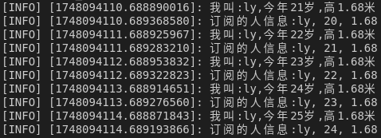

# 自定义话题通信的信息格式

## 为什么我们需要自定义话题通信的信息格式
`ROS `中通过 `std_msgs` 封装了一些原生的数据类型,比如:`String`、`Int32`、`Int64`、`Char`、`Bool`、`Empty`.... 但是，这些数据一般只包含一个 `data` 字段，结构的单一意味着功能上的局限性，当传输一些复杂的数据，比如: 激光雷达的信息... `std_msgs` 由于描述性较差而显得力不从心，这种场景下可以使用自定义的消息类型。

## 自定义`msg`的步骤
### 定义`msg`文件
`msg`文件中，每行对应一个字段，包含字段类型和名称，例如
```msg
string name
uint16 age
float64 height
```
该文件需要在功能包中新建`msg`目录，添加新文件`xxx.msg`
### 编辑配置文件`package.xml`与`CMakeLists.txt`
    建议创建功能包时除`roscpp` `rospy` `std_msgs`外额外加入`message_generation`
对于`package.xml`，添加编译依赖与执行依赖：
```xml
<build_depend>message_generation</build_depend>
<exec_depend>message_runtime</exec_depend>
```
这里如果我们在创建功能包时就已经加入了编译依赖`message_generation`，则只需要添加第二行的执行依赖`message_runtime`

值得注意的是，没有显式添加`message_runtime`也能正常运行，这通常是因为其他依赖项（例如`roscpp`或`std_msgs`）可能已经隐含地包含了`message_runtime`。在这种情况下，构建系统已经处理了消息生成的任务。

然而，为了确保软件包在所有情况下都能正常工作，最好显示添加`message_runtime`作为你的软件包的运行依赖项。这样可以确保你的消息定义在构建和运行时得到正确处理。

另外值得注意的是，如果我在创建功能包时添加了`message_runtime`的依赖，生成的`package.xml`将包含`<exec_depend>message_runtime</exec_depend>`\
但是这也会引起`CMakeList`中的`find_peckage`包含`message_runtime`，如果不删除，将无法正常编译\
这是因为在`CMakeList`中find的`peckage`需要在`peckage.xml`中包含`<build_depend>xxx</build_depend>`，但是实际并不包含`<build_depend>message_runtime</build_depend>`。

对于`CMakeLists.txt`

    若在创建功能包时就已经加入了编译依赖message_generation\
    否则需要在find_package中加入message_generation

```CMake
# 配置msg源文件
add_message_files(
  FILES
  Person.msg
)
# 配置消息生成的依赖为std_msgs
generate_messages(
  DEPENDENCIES
  std_msgs
)
# 这个其实文件里面有，只需要取消第三行注释即可
# 但要把message_generation换为message_runtime
catkin_package(
#  INCLUDE_DIRS include
#  LIBRARIES demo02_talker_listener
  CATKIN_DEPENDS roscpp rospy std_msgs message_runtime
#  DEPENDS system_lib
)
```
### 编译
编译通过后，将在`.../工作空间/devel/include/包名/xxx.h`中看到调用的中间文件
### 总结自定义msg的步骤
    1. 建议在创建功能包时加入额外的依赖message_generation
    2. 创建msg/xxx.msg，在其中定义多个字段
    3. 修改peckage.xml，加入<exec_depend>message_runtime</exec_depend>
    4. 修改CMakeList.txt，加入add_message_files generate_messages\
        并将catkin_package的第三行取消注释
        将message_generation换为message_runtime
    5. 编译，查看'.../工作空间/devel/include/包名/xxx.h'是否存在中间文件


## 具体代码实例
先在`c_cpp_properties.json`的`includepath`属性加入`"/xxx/yyy工作空间/devel/include/**"`，方便代码提示
### `Talker`
```C++
#include "ros/ros.h"
#include "msg_self/Person.h"

int main(int argc, char *argv[]){
    setlocale(LC_ALL, "");

    ros::init(argc, argv, "msgtalker");
    ros::NodeHandle nh;
    ros::Publisher msgpub = nh.advertise<msg_self::Person>("msgself", 1000);
    ros::Duration(3.0).sleep();
    msg_self::Person p;
    p.name = "ly";
    p.age = 20;
    p.height = 1.68;
    ros::Rate r(1);

    while (ros::ok())
    {
        msgpub.publish(p);
        p.age += 1;
        ROS_INFO("我叫:%s,今年%d岁,高%.2f米", p.name.c_str(), p.age, p.height);
        r.sleep();
        ros::spinOnce();
    }
    return 0; 
}
```
### `Listener`
```C++
#include "ros/ros.h"
#include "msg_self/Person.h"

void doMsg(const msg_self::Person::ConstPtr& person_p){
    ROS_INFO("订阅的人信息:%s, %d, %.2f", person_p->name.c_str(), person_p->age, person_p->height);
}

int main(int argc, char *argv[]){
    setlocale(LC_ALL, "");

    ros::init(argc, argv, "msglistener");
    ros::NodeHandle nh;

    ros::Subscriber msgsub = nh.subscribe<msg_self::Person>("msgself",10, doMsg);

    ros::spin();
    return 0;
}
```
### `CMakeList`
```CMake
add_executable(msg_talker src/msg_talker.cpp)
add_executable(msg_listener src/msg_listener.cpp)
add_dependencies(msg_talker ${PROJECT_NAME}_generate_messages_cpp)
add_dependencies(msg_listener ${PROJECT_NAME}_generate_messages_cpp)
target_link_libraries(msg_talker
   ${catkin_LIBRARIES}
)
target_link_libraries(msg_listener
   ${catkin_LIBRARIES}
)
```
### `launch`
```launch
<launch>
    <node pkg="msg_self" type="msg_talker" name="msg_talker" output="screen" />
    <node pkg="msg_self" type="msg_listener" name="msg_listener" output="screen" />
</launch>
```
### 实现结果

