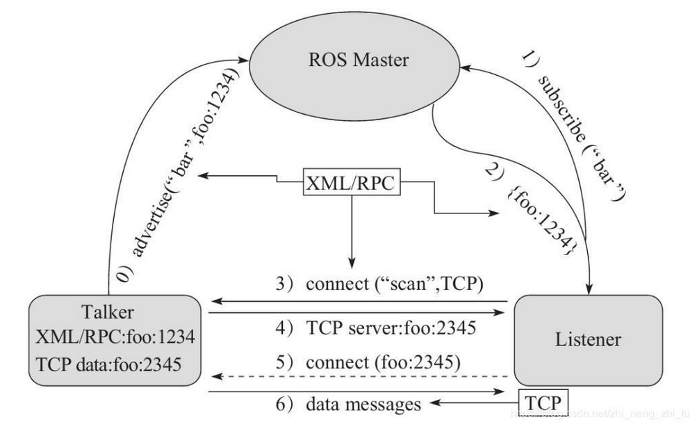
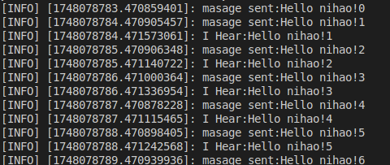
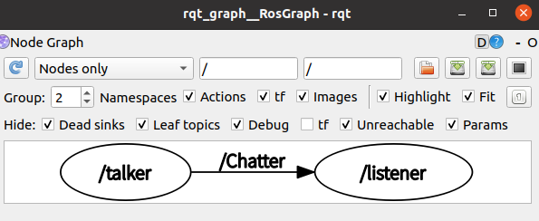
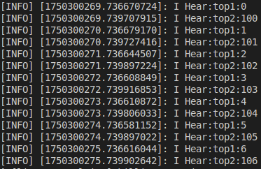
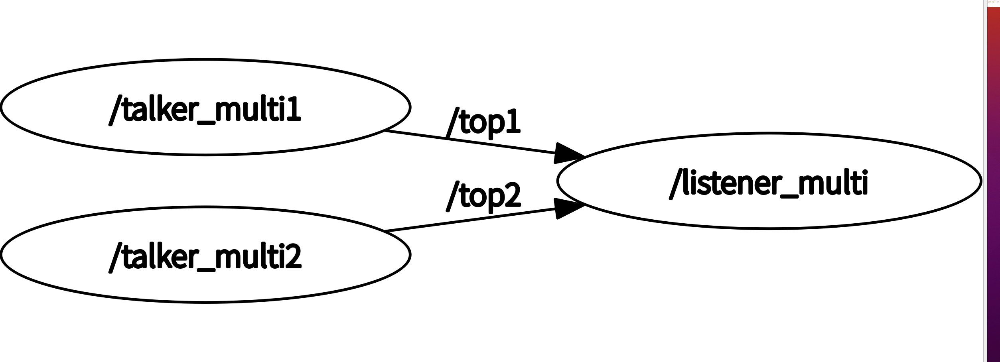

# 话题通信

## 理论模型


### 话题通信的三个角色：

- `ROS Master` -- `管理者` \
-> 负责保管 `Talker` 和 `Listener` 注册的信息并匹配话题相同的 `Talker` 与 `Listener`
- `Talker` -- `发布者` \
-> 发布消息
- `Listener` -- `订阅者` \
-> 订阅来自`Talker`的消息

### 话题通信的步骤：

    1. Talker向Master注册自身信息，包括发布的话题名称
    2. Listener向Master注册自身信息，包括订阅的话题名称
    3. Master将Talker和Listener进行匹配
    4. Master匹配完成后，将Talker的RPC地址发送给Listener
    5. Listener根据RPC地址，通过RPC向Talker发送连接请求
    6. Talker确认连接信息，发送自己的TCP地址信息
    7. Listener根据Talker的TCP地址信息，通过TCP通讯协议与Talker建立连接
    =============================================================
### 注意点

    1. Talker与Listener的连接使用的是RPC协议，但最后两步通讯使用TCP协议
    2. Talker与Listener无先后启动顺序要求
    3. Talker与Listener可以有多个
    4. Talker与Listener连接后，不再需要Master，因此即使关闭Master，二者仍可正常通信
    =============================================================

## `C++`的话题通讯基本操作

### 实际的话题通信建立过程，我们关注什么？

    需要关注的：
    1. Talker
    2. Listener
    3. 通信的数据
    =============================================================
    无需关注的：
    1. ROS Master
    2. 连接过程（RPC、TCP等）
    这是因为这两部分内容已经被封装

### 话题通讯模型建立流程

    1. 编写Talker实现
    2. 编写Listener实现
    3. 编辑配置文件CmakeList等
    4. 编译并执行（Vscode使用crtl+shift+B编译）

## `Talker`
### 代码实现
```C++
/*
    消息发布方:
        循环发布信息:HelloWorld 后缀数字编号
    实现流程:
        1.包含头文件 
        2.初始化 ROS 节点:命名(唯一)
        3.实例化 ROS 句柄
        4.实例化 发布者 对象
        5.组织被发布的数据，并编写逻辑发布数据
*/
#include "ros/ros.h"
#include "std_msgs/String.h"
#include <sstream>
int main(int argc, char *argv[]){
    //1. 设置编码
    setlocale(LC_ALL, "");
    //2.初始化 ROS 节点:命名(唯一)
    ros::init(argc, argv, "Talker");
    //3.实例化 ROS 句柄
    ros::NodeHandle nh;//该类封装了 ROS 中的一些常用功能
     //4.实例化 发布者 对象
    ros::Publisher pub = nh.advertise<std_msgs::String>("Chatter", 10);
    //5.组织被发布的数据，并编写逻辑发布数据
    std_msgs::String msg;
    std::string msg_front = "Hello nihao!";
    int count = 0;
    //循环（一秒10次）
    ros::Rate r(1);
    while (ros::ok())
    {
        std::stringstream ss;
        ss << msg_front << count;
        msg.data = ss.str();
        pub.publish(msg);
        ROS_INFO("masage sent:%s",msg.data.c_str());
        r.sleep();
        count ++;
        ros::spinOnce();
    }
    return 0;
}
```

### 代码中的名词：
1. `节点`：ROS系统中程序运行与通信的基本单位，一个程序只能对应一个`节点`，节点的命名是唯一的
2. `句柄`：可以简单理解为节点的把柄，系统可以根据句柄的使用情况，开启或关闭节点来节省内存。一个节点可以对应多个句柄，一个句柄可以对于多个`Talker`与`Listener`

### C++代码
1. `ros::init(argc, argv, "name")`\
这行代码用于初始化一个ROS节点，\
`argc` `argv`后期传值使用\
`name`表示节点的命名，节点的命名是唯一的，不可重复
2. `ros::NodeHandle nh`\
   实例化一个句柄对象，名称为`nh`，该类封装了 ROS 中的一些常用功能
3. `ros::Publisher pub`\
   实例化一个`Talker`对象，名称为`pub`，这行代码同时实现了注册的功能
4. `nh.advertise<std_msgs::String>("Chatter", 10)`\
   利用句柄`nh`，\
   `nh.advertise("Chatter", 10)`表示当前节点要发布话题\
   `"Chatter"`为话题的名称，该名称为`Listener`的订阅对象\
   `10`表示发送信息在大于10个之后舍弃之前发布的消息\
   `<std_msgs::String>`表示发布的话题消息类型
5. `std_msgs::String`\
   为ROS系统的标准消息之一`String`
6. `ros::ok()`\
   可用于检测`crtl+c`退出，当检测到`crtl+c`时，变为`False`循环终止\
   或所有节点被关闭时，输出`False`
7. `pub.publish(msg)`\
   实例化的`Talker`发布消息`msg`
8. `ros::Rate r(1)`\
   用作定时器的作用，`1`表示`1hz`\
   结合`r.sleep()`完成定时效果
9. `ros::spinOnce()`\
    十分重要的函数，称为消息回调处理函数\
    没有这行代码，`Listener`就不会执行回调函数`Callback`，而是只仅仅进行实参传输

## Listener
### 代码实现
```C++
#include "ros/ros.h"
#include "std_msgs/String.h"

void doMsg(const std_msgs::String::ConstPtr& msg_p){
    ROS_INFO("I Hear:%s",(*msg_p).data.c_str());
}

int main(int argc, char *argv[]){
    setlocale(LC_ALL, "");

    ros::init(argc, argv, "Listener");
    ros::NodeHandle nh;
    ros::Subscriber sub = nh.subscribe("Chatter", 10, doMsg);
    ros::spin();
    return 0;
}
```
### 代码的解读
- 可以看到相比于`Talker`，`Listener`多了一个`doMsg`的回调函数，少了一个`publish`
- 回调函数的作用在于，`Listener`每次接收到消息之后，都会将接收的消息传入回调函数，而`ros::spin()`函数负责控制执行该回调函数，与`ros::spinOnce()`作用类似。
- 缺少类似于`publish`的函数是因为，订阅的过程是被动的，所以被封装化了，在这个订阅的过程中，不断有参数传入回调函数，创建了多个函数内容相同但参数不同的回调函数序列。
- `ros::spin()`和`ros::spinOnce()`的区别在于：
  1. `ros::spin()`是一个内部循环的函数，内部循环不断执行被传入参数的回调函数队列
  2. `ros::spinOnce()`只执行当前回调函数队列中的所有回调函数！！！而不是一个，这是一个很典型的误区。

## CmakeList与launch文件设置
```Cmake
add_executable(talker_test src/talker_test.cpp)
add_executable(listener_test src/listener_test.cpp)

target_link_libraries(talker_test ${catkin_LIBRARIES})
target_link_libraries(listener_test ${catkin_LIBRARIES})
```
```launch
<launch>
    <node pkg="toros_pic_test" type="talker_test" name="talker" output="screen" />
    <node pkg="toros_pic_test" type="listener_test" name="listener" output="screen" />
</launch>
```
## 示例效果

============================================================
## 问题
    1. 为什么订阅时第一条消息丢失了？
这是因为发布第一条消息时，`Listener`还没有注册完毕\
在`publisher`注册完毕之后加入`ros::Duration(3.0).sleep()`休眠一段时间即可

    2. 关于rqt_graph
\
通过该图，可以很好地看出，我们定义了两个节点`talker`和`listener`，`talker`发布了话题`Chatter`，`Listener`订阅

## 总结 -- 在代码中我们究竟需要做什么？
- 编写`Talker`节点，应包括节点初始化、句柄初始化、基于句柄实例注册发布者（包括其话题名称、队列最大保存消息数）、发布消息指令；
- 编写`Listener`节点，应包括节点初始化、句柄初始化、基于句柄实例注册订阅者、编写回调函数、适当使用`spin`函数执行回调；
- 填写`CmakeList`与`launch`文件；


## 附加——如何让发布者只发布一次，订阅者也只订阅一次，且不会丢失该数据
在实际使用中，如果我们想要让发布者只发布一次，随后关闭该节点，订阅者也只订阅一次。\
我们若只是在订阅者中只使用`ros::spinOnce()`很有可能导致发布者发布消息时，订阅者就已经关闭，或者发布者还没来得及发布，订阅者就已经关闭。\
为了解决该问题，我进行了以下改进：
在发布者发布之前：
```C++
while (pub.getNumSubscribers()<1);//等待有订阅者出现
pub.publish(msg);
```
在订阅者中加入条件循环：
```C++
bool massageReceived = false;
void callback(const std_msgs::Float32MultiArray::ConstPtr& msg){
    massageReceived = true;
}

int main(int argc, char *argv[]){

    ros::init(argc, argv, "vector_filed");
    ros::NodeHandle nh;
    ros::Subscriber sub = nh.subscribe<std_msgs::Float32MultiArray>("RBF", 1, get_w);
    while (!massageReceived)
    {
        // 在受到信息之前一直执行回调，防止因发布者发布过慢，订阅者提前关闭
        ros::spinOnce();
    }
    
    return 0;
}
```
但是此时还是无法解决一个问题，发布者检测到订阅者之后，立即发送，但是订阅者还未来得及初始化完毕，导致丢失数据。\
所以要先启动订阅者节点后启动发布者节点。

`其实，综合下来发现这其实是一个伪需求，如果发布者只发布一次，订阅者也只订阅一次，为什么不把两个节点进行的操作整合到一个节点里面，不需要发布也不需要订阅，但可能需要更好的内存管理。`

## 附加——如果一个节点同时订阅多个话题，那么`ros::spin`函数是如何工作的？

如果一个节点同时订阅多个话题，那么`ros::spin`函数是如何工作的？回调函数序列是怎样的？他是同时执行两个回调函数还是交替执行？我们可以进行实验验证。
结论是：同一个节点的所有接收话题在没有特殊配置的情况下共享同一个回调函数队列，回调函数在`ros::spin`的阻塞进程中依次执行。
实验验证：
### 发布者设置
#### 发布者节点1
发布话题top1 数字从0开始
```cpp
#include "ros/ros.h"
#include "std_msgs/String.h"
#include <sstream>

int main(int argc, char *argv[])
{
    ros::init(argc, argv, "talker_multi1");
    ros::NodeHandle nh;
    ros::Publisher top1 = nh.advertise<std_msgs::String>("top1", 10);
    ros::Duration(1.0).sleep();
    std_msgs::String msg1;
    int count1 = 0;
    std::string msg_front1 = "top1:";
    ros::Rate r(1);
    while (ros::ok())
    {
        std::stringstream ss1;

        ss1 << msg_front1 << count1;
        msg1.data = ss1.str();
        top1.publish(msg1);
        r.sleep();
        count1 ++;

    }
}
```

#### 发布者节点2
发布话题top2 数字从100开始
```cpp
#include "ros/ros.h"
#include "std_msgs/String.h"
#include <sstream>

int main(int argc, char *argv[])
{
    ros::init(argc, argv, "talker_multi2");
    ros::NodeHandle nh;
    ros::Publisher top2 = nh.advertise<std_msgs::String>("top2", 10);
    ros::Duration(1.0).sleep();
    std_msgs::String msg2;
    int count2 = 100;
    std::string msg_front2 = "top2:";
    ros::Rate r(1);
    while (ros::ok())
    {
        std::stringstream ss2;

        ss2 << msg_front2 << count2;
        msg2.data = ss2.str();
        top2.publish(msg2);
        r.sleep();
        count2 ++;

    }
}
```
### 订阅者设置
```cpp
#include "ros/ros.h"
#include "std_msgs/String.h"

void doMsg1(const std_msgs::String::ConstPtr& msg_p)
{
    ROS_INFO("I Hear:%s",(*msg_p).data.c_str());
}
void doMsg2(const std_msgs::String::ConstPtr& msg_p)
{
    ROS_INFO("I Hear:%s",(*msg_p).data.c_str());
}

int main(int argc, char *argv[])
{
    ros::init(argc, argv, "listener_multi");
    ros::NodeHandle nh;
    ros::Subscriber sub1 = nh.subscribe("top1", 10, doMsg1);
    ros::Subscriber sub2 = nh.subscribe("top2", 10, doMsg2);
    ros::spin();
}
```

### 运行结果


可以看到两个回调函数交替进行，这证明了同一个节点中的多个订阅者订阅不同的话题共用同一个回调函数序列，`ros::spin`阻塞进程中会执行最先进入队列的回调函数。

### 对于发布者和订阅者消息序列的进一步分析
ROS中，publisher和subscriber都有一个消息队列用于数据收发时候的缓存，那么它们的作用分别是什么？
ROS话题的通信是异步的，也就是publisher只管不停的发但不管是否被接收，publisher发送数据后，订阅该toros_pic的subscriber则会过来读取，系统会通过位置指针管理不同subscriber读取消息队列的位置，因此可以支持任意多个subscriber对话题进行读取，每个subscriber读取到数据后，会将数据放入队列中等待回调函数读取。
综上所述，publisher不停将消息发布到消息队列上，直到队列占满，然后新到的消息把最老的消息挤出队列，因此，publisher消息队列的作用就是，缓存一定数量的历史信息，让不能及时订阅的subscriber能读取到之前发布的信息。如果没这个需求或是想让subscriber读取到最新的消息，那么让消息队列长度设为1 。
而subscriber的队列的作用是，缓存来不及处理的消息，例如回调函数执行慢，但消息来的快，这样不至于因为回调函数执行或调用过慢，导致数据的丢失。
其实回调函数队列就相当于是订阅者的消息队列！！！！这样理解就不易混淆。
