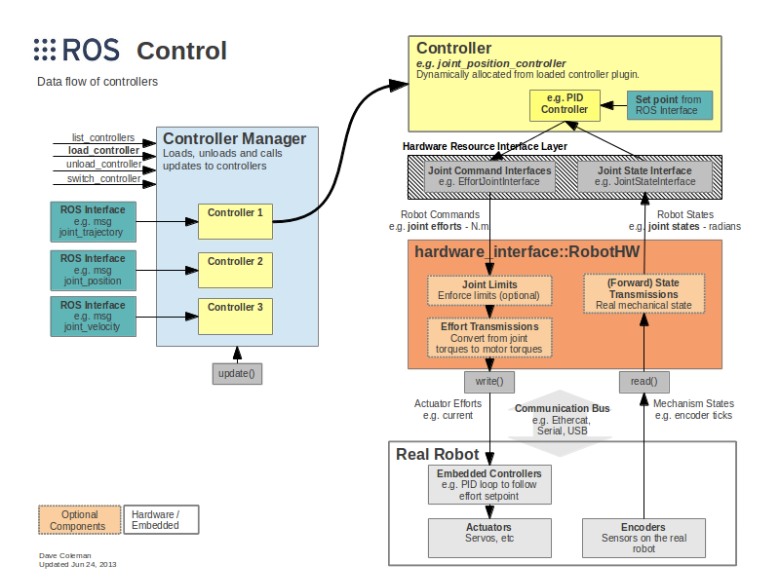
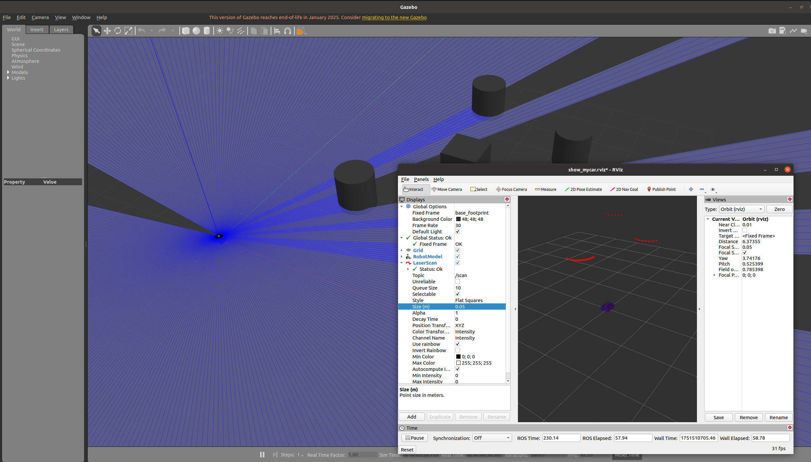

# 阿克曼底盘的URDF建模与Gazebo控制（使用Xacro优化）

## 阿克曼底盘建模
### 建模
我们使用后轮驱动，前轮转向的阿克曼底盘模型。\
那么对于后轮只需进行正常的`continous joint`连接即可\
对于前轮，有两个自由度，旋转和转向，而且由于`URDF`无法进行闭链关节建模，因此我们模拟一个转向杆，使用`revolute joint`限定转向角度首先将`base_link`与转向杆连接，之后使用`continous joint`将转向杆与车轮相连。\
如下为具体实现：
```xml
<robot name="akeman_base" xmlns:xacro="http://www.ros.org/wiki/xacro">
    <xacro:property name="PI" value="3.1415926" />
    <xacro:property name="wheel_radius" value="0.03" />
    <xacro:property name="wheel_height" value="0.02" />
    <xacro:property name="wheel_in" value="0.0125" />
    <xacro:property name="base_linkheight" value="0.075" />
    <xacro:property name="base_length" value="0.225" />
    <xacro:property name="base_width" value="0.2" />
    <xacro:property name="base_height" value="0.01" />

    <link name="base_footprint">
        <visual>
            <geometry>
                <sphere radius="0.001" />
            </geometry>
            <origin xyz="0 0 0" rpy="0 0 0" />
            <material name="yellow">
                <color rgba="0.8 0.3 0.1 0.5" />
            </material> 
        </visual>
    </link>

    <link name="base_link">
        <visual>
            <geometry>
                <box size="${base_length} ${base_width} ${base_linkheight}" />
            </geometry>
            <origin xyz="0 0 0" rpy="0 0 0" />
            <material name="blue">
                <color rgba="0 0 1.0 0.5" />
            </material>
        </visual>
    </link>

    <joint name="base_link2base_footlink" type="fixed">
        <parent link="base_footprint" />
        <child link="base_link" />
        <origin xyz="0 0 ${base_height}" rpy="0 0 0" />
    </joint>

    <xacro:macro name="define_rear_wheel" params="name flag">
        <link name="${name}_rear_wheel">
            <visual>
                <geometry>
                    <cylinder radius="${wheel_radius}" length="${wheel_height}" />
                </geometry>
                <origin xyz="0 0 0" rpy="${flag*PI/2} 0 0" />
                <material name="yellow">
                    <color rgba="0.8 0.3 0.1 0.5" />
                </material>
            </visual>
        </link>
        <joint name="${name}_rear_wheel2base_link" type="continuous">
            <parent link="base_link" />
            <child link="${name}_rear_wheel" />
            <origin xyz="${-(-wheel_in-wheel_radius+base_length/2)} ${flag*(wheel_height/2 + base_width/2)} ${-(base_linkheight/2+base_height-wheel_radius)}" />
            <axis xyz="0 1 0" />
        </joint>
    </xacro:macro>
    <xacro:define_rear_wheel name="left" flag="1" />
    <xacro:define_rear_wheel name="right" flag="-1" />

    <xacro:macro name="define_front_wheel" params="name flag">
        <link name="${name}_front_wheel">
            <visual>
                <geometry>
                    <cylinder radius="${wheel_radius}" length="${wheel_height}" />
                </geometry>
                <origin xyz="0 0 0" rpy="${flag*PI/2} 0 0" />
                <material name="yellow">
                    <color rgba="0.8 0.3 0.1 0.5" />
                </material>
            </visual>
        </link>
        <link name="${name}_steer_front_joint">
            <visual>
                <geometry>
                    <box size="0.01 0.01 0.01" />
                </geometry>
                <origin xyz="0 0 0" rpy="0 0 0" />
                <material name="black">
                    <color rgba="0.7 0.5 0 0.5" />
                </material>
            </visual>
        </link>

        <joint name="${name}_steer_front_joint2base_link" type="revolute">
            <parent link="base_link" />
            <child link="${name}_steer_front_joint" />
            <origin xyz="${-wheel_in-wheel_radius+base_length/2} ${flag*(wheel_height/2 + base_width/2)} ${0.01 + base_linkheight/2}" />
            <axis xyz="0 0 1" />
            <limit lower="-0.69" upper="0.69" effort="0" velocity="3"/>
        </joint>

        <joint name="${name}_front_wheel2${name}_steer_front_joint" type="continuous">
            <parent link="${name}_steer_front_joint" />
            <child link="${name}_front_wheel" />
            <origin xyz="0 0 ${-(0.01+base_linkheight+base_height-wheel_radius)}" />
            <axis xyz="0 1 0" />
        </joint>
    </xacro:macro>
    <xacro:define_front_wheel name="left" flag="1" />
    <xacro:define_front_wheel name="right" flag="-1" />

</robot>
```
### 效果
如下图，可以看到前轮可以通过`GUI`旋转`steer_link`实现转向


## URDF集成Gazebo
较之于 `rviz`，`gazebo`在集成 `URDF` 时，需要做些许修改：
1. 必须添加` collision `碰撞属性相关参数
2. 必须添加 `inertial` 惯性矩阵相关参数
3. `Gazebo`颜色设置也必须做相应的变更
### collision 碰撞属性
如果机器人`link`是标准的几何体形状，和`link`的`visual`属性设置一致即可,但没有颜色属性
### inertial 惯性矩阵
对于标准几何体的惯性矩阵，有标准公式，因此我们可以使用一个专门的`Xacro`文件利用宏封装这些标准几何体的惯性矩阵的公式，之后在其他`Xacro`文件中包含并调用即可;
```xml
<robot name="base" xmlns:xacro="http://wiki.ros.org/xacro">
    <!-- Macro for inertia matrix 球体 圆柱体 立方体-->
    <xacro:macro name="sphere_inertial_matrix" params="m r">
        <inertial>
            <mass value="${m}" />
            <inertia ixx="${2*m*r*r/5}" ixy="0" ixz="0"
                iyy="${2*m*r*r/5}" iyz="0" 
                izz="${2*m*r*r/5}" />
        </inertial>
    </xacro:macro>

    <xacro:macro name="cylinder_inertial_matrix" params="m r h">
        <inertial>
            <mass value="${m}" />
            <inertia ixx="${m*(3*r*r+h*h)/12}" ixy = "0" ixz = "0"
                iyy="${m*(3*r*r+h*h)/12}" iyz = "0"
                izz="${m*r*r/2}" /> 
        </inertial>
    </xacro:macro>

    <xacro:macro name="Box_inertial_matrix" params="m l w h">
       <inertial>
               <mass value="${m}" />
               <inertia ixx="${m*(h*h + l*l)/12}" ixy = "0" ixz = "0"
                   iyy="${m*(w*w + l*l)/12}" iyz= "0"
                   izz="${m*(w*w + h*h)/12}" />
       </inertial>
   </xacro:macro>
</robot>
```
### 颜色设置
在`Gazebo`中显示`link`的颜色，必须指定标签，使用如下指令，该指令与`link`平级
```xml
<gazebo reference="link节点名称">
     <material>Gazebo/Blue</material>
</gazebo>
```

### URDF在Gazebo下可视化
```xml
<launch>
    <!-- 将 Urdf 文件的内容加载到参数服务器 -->
    <param name="robot_description" command="$(find xacro)/xacro $(find urdf_rviz)/urdf/xacro/akeman_base.xacro" />
    <!-- 启动 gazebo -->
    <include file="$(find gazebo_ros)/launch/empty_world.launch" />

    <!-- 在 gazebo 中显示机器人模型 -->
    <node pkg="gazebo_ros" type="spawn_model" name="model" args="-urdf -model akemanbase -param robot_description"  />
</launch>
```


## Gazebo与ROS_control
在前面`Rviz`中，我们使用了`joint_state_publisher_gui`节点来控制关节的转动，但是也只是转动，没有任何的物理属性，例如我们转动车轮关节，小车并不会移动。`Gazebo`相对于`Rviz`的优点也在于此，`Gazebo`有真实的物理引擎，可以通过给关节加入传动装置实现运动控制。
具体使用`Gazebo`仿真，我们借助`ROS_Control`软件包实现，其工作流图下图可以很好的展现（源自ROS wiki）：
其主要由以下几部分组成：
- `Controller Manager` 控制器管理器：管理不同控制器的通用接口
- `Controller` 控制器：读取硬件资源接口中的状态，运行PID等控制器发布控制指令。不直接接触硬件，也从硬件抽象层请求读取资源
- `RobotHW` 机器人硬件抽象：可以直接和硬件资源交互，通过 `write` 和 `read` 方法完成硬件操作。管理硬件资源，处理硬件冲突
- `Hardware Resource` 硬件资源：提供硬件资源的接口，包含硬件关节限制、传动机构等，我们配置传动机构实际就是配置硬件资源

## 传动装置Transmission的添加
传动系统用于将机器人的关节指令转换成执行器的控制信号，可在机器人的`URDF`模型文件中配置。下面为一个`Transmission`的示例：
```xml
<transmission name="trans_name" > 
    <type>transmission_interface/SimpleTransmission</type>
    <joint name="foo_joint">
        <hardwareInterface>hardware_interface/EffortJointInterface</hardwareInterface>
    </joint>
    <actuator name="foo_motor">
        <mechanicalReduction>50</mechanicalReduction>
        <hardwareInterface>hardware_interface/EffortJointInterface</hardwareInterface>
    </actuator>
</transmission>
```
- `<transmission name="trans_name" > `定义传动机构名称
- `<joint name="foo_joint">` 指定传动装置对应关节
  - `<hardwareInterface>` 定义硬件接口，选用力关节接口即可
- `<actuator name="foo_motor">` 定义传动执行器
  - `<mechanicalReduction>50</mechanicalReduction>`定义了电机／关节减速比
  - `<hardwareInterface>hardware_interface/EffortJointInterface</hardwareInterface>`定义了支持的硬件接口，包含力、速度`hardware_interface/VelocityJointInterface`、位置`hardware_interface/PositionJointInterface`。
  - `<motorTorqueConstant>`（可选）定义了电机的转矩参数
在我们的阿克曼小车模型中，我们需要对后轮增加两个旋转电机，前轮增加两个舵机控制角度。对应的关节分别为`${name}_rear_wheel2base_link`和`${name}_front_wheel2${name}_steer_front_joint`。
加入传动装置后，我们还需要加入插件进行`gazebo`和`ros_control`的对接，`gazebo_ros_control`是`Gazebo`的一个插件用来根据设定装载合适的硬件接口和控制器。示例如下：
```xml
<gazebo>
	<plugin name="gazebo_ros_control" filename="libgazebo_ros_control.so">
		<robotNamespace></robotNamespace>
		<robotParam>robot_description</robotParam>
		<robotSimType>gazebo_ros_control/DefaultRobotHWSim</robotSimType>
		<legacyModeNS>true</legacyModeNS>
	</plugin>
</gazebo>
```
- `<robotNamespace>`用来定义插件其对象的ROS命名空间，默认是URDF或者SDF对应的机器人名称。
- `<contolPeriod>`用来定义控制器的更新周期，单位为秒，默认使用Gazebo的周期。
- `<robotParam>`用来定义ROS参数服务器上的机器人描述(URDF)路径，默认是"/robot_description"。
- `<robotSimType>`用来定义机器人仿真接口所使用的插件库名称，默认是"DefaultRobotHWSim"。
- `<legacyModeNS>`用来兼容之前ROS版本的配置。
另外，也可以添加属性`reference`，这样它就是对整个机器人`<robot>`的描述。

## Controller 控制器
对于Akermann小车，我们可以借助`ros-controllers`软件包下的`ackermann_steering_controller`来实现，但需要额外安装，运行以下指令即可。
```
sudo apt-get install ros-noetic-ros-control ros-noetic-ros-controllers
```
此外，`steer_bot_hardware_gazebo`支持四轮控制器，但该软件包最高只支持到了`melodic`版本（可以在`github`查阅下载编译），本人使用的是`noetic`版本，所以无法安装。
如果使用鱼香ROS一键安装，则需要再次使用一键安装中的配置系统源中重新配置更换系统源和加入ROS源。

查阅ROS wiki，可以发现`ackermann_steering_controller`仅支持前后两个轮的小车模型，因此我们需要对模型进行一定的修改，方便进行控制。
在两后轮之间加入一个虚拟轮，该虚拟后轮首先与基座之间形成`continous joint`，再和两个后轮分别形成`continous joint`，此时旋转虚拟后轮则相当于旋转两个后轮。
将前向的两个模拟转向关节合为一个，旋转合并后的关节就相当于同时进行两个轮转向。
这个方法太过逆天，实际上并不适合实际的仿真系统，故舍弃！！！
为了更贴合真实情况，我们还是为两个前轮都加入了转向关节，并为能够在`gazebo`中正常显示，进行了适应性修改。

`ros_control`功能包提供的控制器有许多，以下为案例：

在`ros_controllers`的`wiki`中可以发现更多：

## Gazebo建模中出现的问题，以及如何解决


### 问题1：轮子陷入地面！
首先检查，`base_link`和`base_footprint`之间的距离是否合理
其次，车轮的`collision`中的`origin`和`visual`中的是否相同，尤其是旋转`RPY`一定要检查！

### 问题2：小车歪七八扭？

1. 检查小车的物理特性是否合理，例如重力上是否可以让车轮支撑底座（Gazebo是一个物理仿真平台，因此一定要注意这一点）
2. 惯性矩阵问题，是否出现赋予错的惯性矩阵？
3. 车轮的`visual`属性和`collision`属性是否保持一致，不要忘记`PI/2`
### 问题3：如何让一个物体和另一个物体连接在一起？并且我们希望二者中间存在一个自由度？

`Gazebo`中，我们只需要在建模时，让两者的位置嵌合在一起，就可以保证二者不会因为重力而分离

### 问题4：`revolute`关节晃来晃去？
对该关节增加阻尼：
```xml
<dynamics damping="0.5" />
```
### 关于关节？
`joints`的作用不仅可以在`link`之间建立运动关系，同时还会把他们链接成一个整体，相当于现实中的螺丝连接等方式。

## 多次迭代优化后可以在Gazebo中稳定的阿克曼小车底盘
```xml
<?xml version="1.0" ?>
<robot name="ackermann_base_final" xmlns:xacro="http://www.ros.org/wiki/xacro">
    <!-- 参数 -->
    <xacro:property name="PI" value="3.1415926" />
    <!-- 车轮参数 -->
    <xacro:property name="wheel_radius" value="0.04" />
    <xacro:property name="wheel_height" value="0.03" />
    <xacro:property name="wheel_in" value="0.0125" />
    <!-- 基座参数 -->   
    <xacro:property name="base_height" value="0.075" />
    <xacro:property name="base_length" value="0.275" />
    <xacro:property name="base_width" value="0.2" />
    <!-- 车轮参数 -->
    <xacro:property name="steering_link_length" value="0.02" /> 
    <xacro:property name="steering_link_width" value="0.06" />
    <xacro:property name="steering_link_height" value="0.02" />
    <!-- 基座离地高度 -->
    <xacro:property name="base_ground_clearance" value="0.02" />
    <!-- 质量参数 -->
    <xacro:property name="base_m" value="2" />
    <xacro:property name="wheel_m" value="0.5" />  
    <xacro:property name="steering_link_m" value="0.05" /> 

    <xacro:include filename="inertial_matrix.xacro"/>

    <link name="base_footprint">
        <visual>
            <origin xyz="0.0 0.0 0.0" rpy="0.0 0.0 0.0"/>
            <geometry>
                <sphere radius="0.001"/>
            </geometry>
            <material name="yellow">
                <color rgba="0.8 0.3 0.1 0.5" />
            </material> 
        </visual>
        <collision>
            <origin xyz="0.0 0.0 0.0" rpy="0.0 0.0 0.0"/>
            <geometry>
                <sphere radius="0"/>
            </geometry>
        </collision>
    </link>

    <link name="base_link">
        <xacro:Box_inertial_matrix m="${base_m}" l="${base_length}" w="${base_width}" h="${base_height}" />
        <visual>
            <origin xyz="0.0 0.0 0.0" rpy="0.0 0.0 0.0"/>
            <geometry>
                <box size="${base_length} ${base_width} ${base_height}"/>
            </geometry>
            <material name="blue">
                <color rgba="0 0 1.0 0.5" />
            </material>
        </visual>
        <collision>
            <origin xyz="0.0 0.0 0.0" rpy="0.0 0.0 0.0"/>
            <geometry>
                <box size="0 0 0"/>
            </geometry>
        </collision>
    </link>
    <gazebo reference="base_link">
            <material>Gazebo/Blue</material>
        </gazebo>
    <joint name="base_link2base_footprint" type="fixed">
        <parent link="base_footprint"/>
        <child link="base_link"/>
        <origin xyz="0.0 0.0 ${base_ground_clearance+base_height/2+0.001}" rpy="0.0 0.0 0.0"/>
    </joint>

    <xacro:macro name="define_steer_joint" params="name flag">
        <link name="${name}_steer_link">
            <xacro:Box_inertial_matrix m="${steering_link_m}" l="${steering_link_length}" w="${steering_link_width}" h="${steering_link_height}" />
            <visual>
                <origin xyz="0.0 0.0 0.0" rpy="0.0 0.0 0.0"/>
                <geometry>
                    <box size="${steering_link_length} ${steering_link_width} ${steering_link_height}"/>
                </geometry>
            </visual>
            <collision>
                <origin xyz="0.0 0.0 0.0" rpy="0.0 0.0 0.0"/>
                <geometry>
                    <box size="0 0 0"/>
                </geometry>
            </collision>
        </link>
        <joint name="${name}_steer_link2base_link" type="revolute">
            <origin xyz="${base_length/2-wheel_in-wheel_radius} ${flag*(base_width/2-steering_link_width/2)} ${-(base_height/2 + base_ground_clearance - wheel_radius)}" rpy="0.0 0.0 0.0"/>
            <parent link="base_link"/>
            <child link="${name}_steer_link"/>
            <axis xyz="0 0 1"/>
            <dynamics damping="0.1" />
            <limit lower="-0.6" upper="0.6" effort="0" velocity="3"/>
        </joint>
        <gazebo reference="${name}_steer_link">
            <material>Gazebo/Yellow</material>
        </gazebo>
    </xacro:macro>
    <xacro:define_steer_joint name="left" flag="1" />
    <xacro:define_steer_joint name="right" flag="-1" />

    <xacro:macro name="define_front_joint" params="name flag">
        <link name="${name}_front_wheel">
            <xacro:cylinder_inertial_matrix m="${wheel_m}" r="${wheel_radius}" h="${wheel_height}" />
            <visual>
                <origin xyz="0.0 0.0 0.0" rpy="${-PI/2} 0.0 0.0"/>
                <geometry>
                    <cylinder radius="${wheel_radius}" length="${wheel_height}"/>
                </geometry>
            </visual>
            <collision>
                <origin xyz="0.0 0.0 0.0" rpy="${-PI/2} 0.0 0.0"/>
                <geometry>
                    <cylinder radius="${wheel_radius}" length="${wheel_height}"/>
                </geometry>
            </collision>
        </link>
        <gazebo reference="${name}_front_wheel">
            <material>Gazebo/Yellow</material>
        </gazebo>
        <gazebo reference="${name}_front_wheel">
            <mu1>0.6</mu1>    <!-- 显著降低静摩擦 -->
            <mu2>0.9</mu2>    <!-- 降低动摩擦 -->
        </gazebo>  
        <joint name="${name}_front_wheel2${name}_steer_link" type="continuous">
            <origin xyz="0 0 0.0" rpy="0.0 0.0 0.0"/>
            <parent link="${name}_steer_link"/>
            <child link="${name}_front_wheel"/>
            <axis xyz="0 1 0"/>
        </joint>
    </xacro:macro>
    <xacro:define_front_joint name="left" flag="1" />
    <xacro:define_front_joint name="right" flag="-1" />

    <xacro:macro name="define_rear_joint" params="name flag">
        <link name="${name}_rear_link">
            <xacro:Box_inertial_matrix m="${steering_link_m}" l="${steering_link_length}" w="${steering_link_width}" h="${steering_link_height}" />
            <visual>
                <origin xyz="0.0 0.0 0.0" rpy="0.0 0.0 0.0"/>
                <geometry>
                    <box size="${steering_link_length} ${steering_link_width} ${steering_link_height}"/>
                </geometry>
            </visual>
            <collision>
                <origin xyz="0.0 0.0 0.0" rpy="0.0 0.0 0.0"/>
                <geometry>
                    <box size="0 0 0"/>
                </geometry>
            </collision>
        </link>
        <link name="${name}_rear_wheel">
            <xacro:cylinder_inertial_matrix m="${wheel_m}" r="${wheel_radius}" h="${wheel_height}" />
            <visual>
                <origin xyz="0.0 0.0 0.0" rpy="${-PI/2} 0.0 0.0"/>
                <geometry>
                    <cylinder radius="${wheel_radius}" length="${wheel_height}"/>
                </geometry>
            </visual>
            <collision>
                <origin xyz="0.0 0.0 0.0" rpy="${-PI/2} 0.0 0.0"/>
                <geometry>
                    <cylinder radius="${wheel_radius}" length="${wheel_height}"/>
                </geometry>
            </collision>
        </link>
        <gazebo reference="${name}_rear_wheel">
            <mu1>1.8</mu1>    <!-- 大幅提高静摩擦 -->
            <mu2>1.2</mu2>    <!-- 提高动摩擦 -->
        </gazebo>  
        <joint name="${name}_rear_link2base_link" type="fixed">
            <origin xyz="${-base_length/2+wheel_in+wheel_radius} ${flag*(base_width/2-steering_link_width/2)} ${-(base_height/2 + base_ground_clearance - wheel_radius)}" rpy="0.0 0.0 0.0"/>
            <parent link="base_link"/>
            <child link="${name}_rear_link"/>
        </joint>
        <joint name="${name}_rear_wheel2${name}_rear_link" type="continuous">
            <origin xyz="0 0 0.0" rpy="0.0 0.0 0.0"/>
            <parent link="${name}_rear_link"/>
            <child link="${name}_rear_wheel"/>
            <axis xyz="0 1 0"/>
        </joint>
        <gazebo reference="${name}_rear_wheel">
            <material>Gazebo/Yellow</material>
        </gazebo>
    </xacro:macro>
    <xacro:define_rear_joint name="left" flag="1" />
    <xacro:define_rear_joint name="right" flag="-1" />
    <xacro:macro name="define_wheel_trans" params="left_right front_rear steer_rear">
        <transmission name="${left_right}_${front_rear}_wheel_trans">
            <type>transmission_interface/SimpleTransmission</type>
            <joint name="${left_right}_${front_rear}_wheel2${left_right}_${steer_rear}_link">
                <hardwareInterface>hardware_interface/VelocityJointInterface</hardwareInterface>
            </joint>
            <actuator name="${left_right}_${front_rear}_wheel_actuator">
                <mechanicalReduction>1.0</mechanicalReduction>
                <hardwareInterface>hardware_interface/VelocityJointInterface</hardwareInterface>
            </actuator>
        </transmission>
    </xacro:macro>
    <xacro:macro name="define_steer_trans" params="left_right">
        <transmission name="${left_right}_steer_trans">
            <type>transmission_interface/SimpleTransmission</type>
            <joint name="${left_right}_steer_link2base_link">
                <hardwareInterface>hardware_interface/PositionJointInterface</hardwareInterface>
            </joint>
            <actuator name="${left_right}_steer_actuator">
                <mechanicalReduction>1.0</mechanicalReduction>
                <hardwareInterface>hardware_interface/PositionJointInterface</hardwareInterface>
            </actuator>
        </transmission>
    </xacro:macro>
    <xacro:define_wheel_trans left_right="left" front_rear="rear" steer_rear="rear" />
    <xacro:define_wheel_trans left_right="right" front_rear="rear" steer_rear="rear" />
    <xacro:define_steer_trans left_right="left" />
    <xacro:define_steer_trans left_right="right" />
    <gazebo>
        <plugin name="gazebo_ros_control" filename="libgazebo_ros_control.so">
            <robotNamespace>ackermann_base_final</robotNamespace>
            <robotParam>robot_description</robotParam>
            <robotSimType>gazebo_ros_control/DefaultRobotHWSim</robotSimType>
            <legacyModeNS>true</legacyModeNS>
            <robotBaseFrame>base_footprint</robotBaseFrame> 
        </plugin>
    </gazebo>
    <gazebo reference="base_footprint">
        <turnGravityOff>true</turnGravityOff>
    </gazebo>


</robot>
```
加入传动装置:
```xml
    <xacro:macro name="define_wheel_trans" params="left_right front_rear steer_rear">
        <transmission name="${left_right}_${front_rear}_wheel_trans">
            <type>transmission_interface/SimpleTransmission</type>
            <joint name="${left_right}_${front_rear}_wheel2${left_right}_${steer_rear}_link">
                <hardwareInterface>hardware_interface/VelocityJointInterface</hardwareInterface>
            </joint>
            <actuator name="${left_right}_${front_rear}_wheel_actuator">
                <mechanicalReduction>1.0</mechanicalReduction>
                <hardwareInterface>hardware_interface/VelocityJointInterface</hardwareInterface>
            </actuator>
        </transmission>
    </xacro:macro>
    <xacro:macro name="define_steer_trans" params="left_right">
        <transmission name="${left_right}_steer_trans">
            <type>transmission_interface/SimpleTransmission</type>
            <joint name="${left_right}_steer_link2base_link">
                <hardwareInterface>hardware_interface/PositionJointInterface</hardwareInterface>
            </joint>
            <actuator name="${left_right}_steer_actuator">
                <mechanicalReduction>1.0</mechanicalReduction>
                <hardwareInterface>hardware_interface/PositionJointInterface</hardwareInterface>
            </actuator>
        </transmission>
    </xacro:macro>
    <xacro:define_wheel_trans left_right="left" front_rear="rear" steer_rear="rear" />
    <xacro:define_wheel_trans left_right="right" front_rear="rear" steer_rear="rear" />
    <xacro:define_steer_trans left_right="left" />
    <xacro:define_steer_trans left_right="right" />
    <gazebo>
        <plugin name="gazebo_ros_control" filename="libgazebo_ros_control.so">
            <robotNamespace>ackermann_base_final</robotNamespace>
            <robotParam>robot_description</robotParam>
            <robotSimType>gazebo_ros_control/DefaultRobotHWSim</robotSimType>
            <legacyModeNS>true</legacyModeNS>
            <robotBaseFrame>base_footprint</robotBaseFrame> 
        </plugin>
    </gazebo>
```
最终建模效果:

## 阿克曼小车的控制器设置yaml
值得注意的是，我们没有在前轮的两个转动轮上加入电机，这是因为一旦加入传动装置，该关节的从动属性将消失，无法被后轮从动。
```yaml
ackermann_base_final:
  joint_state_controller:
    type: "joint_state_controller/JointStateController"
    publish_rate: 50
  left_steer_controller:
    type: "position_controllers/JointPositionController"
    joint: left_steer_link2base_link
  right_steer_controller:
    type: "position_controllers/JointPositionController"
    joint: right_steer_link2base_link
  left_rear_wheel_controller:
    type: "velocity_controllers/JointVelocityController"
    joint: left_rear_wheel2left_rear_link
  right_rear_wheel_controller:
    type: "velocity_controllers/JointVelocityController"
    joint: right_rear_wheel2right_rear_link
```
## 启动Gazebo的launch文件
```xml
<launch>
    <!-- 将 Urdf 文件的内容加载到参数服务器 -->
    <param name="robot_description" command="$(find xacro)/xacro $(find urdf_rviz)/urdf/xacro/ackermann_base_final.xacro" />
    <!-- 启动 gazebo -->
    <include file="$(find gazebo_ros)/launch/empty_world.launch" />

    <!-- 在 gazebo 中显示机器人模型 -->
    <node pkg="gazebo_ros" type="spawn_model" name="model" args="-urdf -model ackermann_base_final -param robot_description"  />
    <!-- 加载控制器参数 -->
    <rosparam file="$(find urdf_rviz)/config/rviz/ackermann/ackermann_base_final.yaml" command="load"/>
    <node name="controller_spawner" pkg="controller_manager" type="spawner" output="screen"
        ns="/ackermann_base_final"
        args="
          joint_state_controller
          left_steer_controller
          right_steer_controller
          left_rear_wheel_controller
          right_rear_wheel_controller
        " />

</launch>`
```


### 问题解决：
#### [ERROR] Could not load controller 'right_steer_controller' because the type was not specified. 
这个就是因为在yaml中，我们为机器人命了名，为`ackermann_base_final`，所以所有控制器都在该命名空间下，所以要在加载`controller_manager`时，设定`ns="/controller_manager"`
```xml
<node name="controller_spawner" pkg="controller_manager" type="spawner" output="screen"
        ns="/ackermann_base_final"
        args="
          joint_state_controller
          left_steer_controller
          right_steer_controller
          left_rear_wheel_controller
          right_rear_wheel_controller
        " />
```
#### [WARN] Controller Spawner couldn't find the expected controller_manager ROS interface.
可以看到我们在`yaml`中指定轮命名空间，所以在`gazebo`加载插件时也要声明命名空间！所以改为：
```
<gazebo>
    <plugin name="gazebo_ros_control" filename="libgazebo_ros_control.so">
        <robotNamespace>ackermann_base_final</robotNamespace>
        <robotParam>robot_description</robotParam>
        <robotSimType>gazebo_ros_control/DefaultRobotHWSim</robotSimType>
        <legacyModeNS>true</legacyModeNS>
    </plugin>
</gazebo>
```

#### [ERROR] Exception thrown while initializing controller 'right_rear_wheel_controller'.Could not find resource 'right_rear_wheel2right_rear_link' in 'hardware_interface::EffortJointInterface'.

由于我们在定义`transmission`时，使用的h`ardware_interface/PositionJointInterface`，那么对应的控制器也应该为`position_controllers/JointPositionController`，保证能够实现接口的对应。相应的，`PositionJointInterface`对应`position_controllers`，`VelocityJointInterface`对应`velocity_controllers`。


#### [ERROR] No p gain specified for pid.  Namespace: /gazebo_ros_control/pid_gains/left_front_wheel2left_steer_link
提示我们没有为其配置`PID`，实际上我们可以忽略该信息，因为可能配置的还不如系统自动的，该信息源自于`小鱼ROS论坛`

#### 小车车轮空转？
检查base_footprint的实体collision属性是否关闭，若没有关闭则小车将被架在base_footprint上

## 验证
launch后，运行以下bash文件，可以看到阿克曼小车绕圆运行
```bash
# 设置前轮转向角为 0.5 rad（约 28.6 度）
rostoros_pic pub /ackermann_base_final/left_steer_controller/command std_msgs/Float64 "data: 0.47"&rostoros_pic pub /ackermann_base_final/right_steer_controller/command std_msgs/Float64 "data: 0.5"&rostoros_pic pub /ackermann_base_final/left_rear_wheel_controller/command std_msgs/Float64 "data: 5"&rostoros_pic pub /ackermann_base_final/right_rear_wheel_controller/command std_msgs/Float64 "data: 5"
```

## Gazebo地图增加障碍物
Gazebo左侧上方点击Insert即可开始对地图编辑，再点击地图上方的圆柱、正方体等增加圆柱、正方体等形状的障碍物，四个箭头的按键可以对障碍物位置进行移动。
完成后，点击左上角File->save world as进行保存，在launch中增加以下代码，加载地图：
```xml
<include file="$(find gazebo_ros)/launch/empty_world.launch">
    <arg name="world_name" value="$(find urdf_rviz)/worlds/test.world" />
</include>
```
### 问题：SpawnModel: Failure - model name ackermann_base_final already exist
这是因为world文件中包含机器人模型，加载世界时会将机器人模型再次加载，因此直接在world中将机器人模型部分直接删除即可。

## 传感器
### IMU
`IMU`测量物体三轴姿态角(或角速率)以及加速度的装置，在机器人导航中有着很重要的应用。在`Gazebo`仿真中，我们可以直接将`imu`插件附加在`base_link`上。只需要在URDF中加入这段即可。
```xml
<gazebo reference="base_link">
    <gravity>true</gravity>
    <sensor name="imu_sensor" type="imu">
    <always_on>true</always_on>
    <update_rate>100</update_rate>
    <visualize>true</visualize>
    <toros_pic>__default_toros_pic__</toros_pic>
    <plugin filename="libgazebo_ros_imu_sensor.so" name="imu_plugin">
        <robotNamespace>ackermann_base_final</robotNamespace>
        <toros_picName>imu</toros_picName>
        <bodyName>base_link</bodyName>
        <updateRateHZ>100.0</updateRateHZ>
        <gaussianNoise>0.0</gaussianNoise>
        <xyzOffset>0 0 0</xyzOffset>
        <rpyOffset>0 0 0</rpyOffset>
        <frameName>imu_link</frameName>
    </plugin>
    <pose>0 0 0 0 0 0</pose>
    </sensor>
</gazebo>
```
加入后运行时，在命令行输入`rostoros_pic`会出现`/ackermann_base_final/imu`的话题，我们可以利用`rqt_plot`工具展现数据。例如我们使用其订阅`/ackermann_base_final/imu/orientation`可以观察小车的航向角变化。例如我们运行先前的绕圆运行`bash`文件，观察`rqt_plot`可以发现其成正弦波形式，说明小车在绕圆运行。

`rqt_plot`使用tips：
1. 左上角第五个像放大镜的东西点击后，左键框选区域放大，右键缩小
2. 若横轴或纵轴步距过长，可以通过左上角倒数第二个功能进行横坐标和纵坐标展现范围的改变
### 2D单线激光雷达
激光雷达可以通过激光扫描的形式获取障碍物轮廓和位置，为了方便附加Gazebo节点，我们在小车上创建雷达link，并将其驾高。
```xml
<xacro:property name="lidar_m" value="0.2" />
<xacro:property name="lidar_height" value="0.02" />  
<xacro:property name="lidar_radius" value="0.02" /> 
 <link name="lidar_base">
    <xacro:cylinder_inertial_matrix m="0.01" r="0.005" h="0.04" />
    <visual>
        <origin xyz="0.0 0.0 0.0" rpy="0 0.0 0.0"/>
        <geometry>
            <cylinder radius="0.005" length="0.04"/>
        </geometry>
    </visual>
    <collision>
        <origin xyz="0.0 0.0 0.0" rpy="0 0.0 0.0"/>
        <geometry>
            <cylinder radius="${lidar_radius}" length="${lidar_height}"/>
        </geometry>
    </collision>
</link>
<link name="lidar">
    <xacro:cylinder_inertial_matrix m="${lidar_m}" r="${lidar_radius}" h="${lidar_height}" />
    <visual>
        <origin xyz="0.0 0.0 0.0" rpy="0 0.0 0.0"/>
        <geometry>
            <cylinder radius="${lidar_radius}" length="${lidar_height}"/>
        </geometry>
    </visual>
    <collision>
        <origin xyz="0.0 0.0 0.0" rpy="0 0.0 0.0"/>
        <geometry>
            <cylinder radius="${lidar_radius}" length="${lidar_height}"/>
        </geometry>
    </collision>
</link>
<joint name="lidar_base2base_link" type="fixed">
    <parent link="base_link"/>
    <child link="lidar_base"/>
    <origin xyz="0.0 0.0 ${base_height/2+0.02}" rpy="0.0 0.0 0.0"/>
</joint>
<joint name="lidar2lidar_base" type="fixed">
    <parent link="lidar_base"/>
    <child link="lidar"/>
    <origin xyz="0.0 0.0 ${lidar_height/2+0.02}" rpy="0.0 0.0 0.0"/>
</joint>
<gazebo reference="lidar_base">
    <material>Gazebo/red</material>
</gazebo>
<gazebo reference="lidar">
    <material>Gazebo/red</material>
</gazebo>
```

之后附加Gazebo插件，如下：
```xml
<gazebo reference="lidar">
    <sensor type="ray" name="rplidar">
        <pose>0 0 0 0 0 0</pose>
        <visualize>true</visualize>
        <update_rate>5.5</update_rate>
        <ray>
        <scan>
            <horizontal>
            <samples>360</samples>
            <resolution>1</resolution>
            <min_angle>-3</min_angle>
            <max_angle>3</max_angle>
            </horizontal>
        </scan>
        <range>
            <min>0.10</min>
            <max>30.0</max>
            <resolution>0.01</resolution>
        </range>
        <noise>
            <type>gaussian</type>
            <mean>0.0</mean>
            <stddev>0.01</stddev>
        </noise>
        </ray>
        <plugin name="gazebo_rplidar" filename="libgazebo_ros_laser.so">
        <robotNamespace>ackermann_base_final</robotNamespace>
        <toros_picName>/scan</toros_picName>
        <frameName>lidar</frameName>
        </plugin>
    </sensor>
</gazebo>
```
创建一个Launch文件同时启动Gazebo和Rviz
```xml
<launch>
    <!-- 将 Urdf 文件的内容加载到参数服务器 -->
    <param name="robot_description" command="$(find xacro)/xacro $(find urdf_rviz)/urdf/xacro/ackermann_base_final.xacro" />
    <!-- 启动 gazebo -->
    <include file="$(find gazebo_ros)/launch/empty_world.launch">
        <arg name="world_name" value="$(find urdf_rviz)/worlds/test.world" />
    </include>
    <!-- 在 gazebo 中显示机器人模型 -->
    <node pkg="gazebo_ros" type="spawn_model" name="model" args="-urdf -model ackermann_base_final -param robot_description"  />
    <!-- 加载控制器参数 -->
    <rosparam file="$(find urdf_rviz)/config/rviz/ackermann/ackermann_base_final.yaml" command="load"/>
    <node name="controller_spawner" pkg="controller_manager" type="spawner" output="screen"
        ns="/ackermann_base_final"
        args="
          joint_state_controller
          left_steer_controller
          right_steer_controller
          left_rear_wheel_controller
          right_rear_wheel_controller
        " />
    <!-- 启动 rviz -->
    <node pkg="rviz" type="rviz" name="rviz" args="-d $(find urdf_rviz)/config/rviz/show_mycar.rviz"/>
    <!-- 添加关节状态发布节点 -->
    <node pkg="robot_state_publisher" type="robot_state_publisher" name="robot_state_publisher" />
    <node pkg="joint_state_publisher" type="joint_state_publisher" name="joint_state_publisher" />
</launch>
```
在Rviz中add激光雷达信息，并设置其toros_pic为/scan，显示为：


